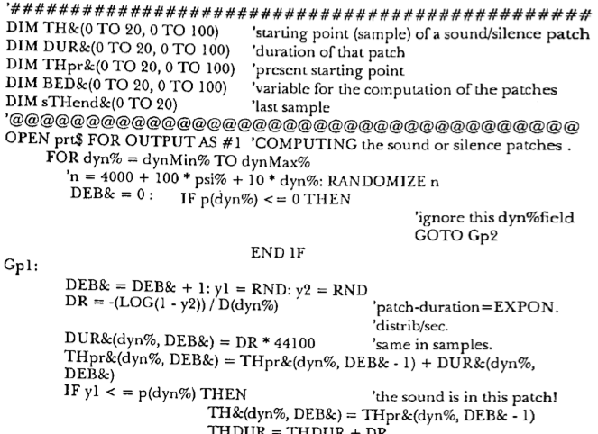

% Composing (Music) in Haskell
% Stuart Popejoy
% March 16, 2016

# Composing with Code

##

## WHY????

- Isn't composing music hard enough???
- Getting a computer to "talk music" is really hard

##



##

```{.javascript}
nums = [n1,n2,n3,n4,n5,n6]; denoms = [d1,d2,d3,d4,d5,d6];
preds = (nums +++ denoms).collect
   { | pair| pair[0] > 0 * pair[1] > 0 };
preds.do { | pred |
  lastNZ = if (lastNZ == nil, { pred }, { lastNZ + pred }); };
freqs = (preds +++ (nums/denoms)).collect { | pr |
	Select.kr(pr[0], [1, pr[1]]); };
ifreqs = nums.size.collect { | i |
	Select.kr(lastNZ, Array.series(i+1,1,0) ++ (denoms/nums)); };
ug = SinOsc.ar(freq); udc = DC.ar(1);
[preds +++ freqs, preds +++ ifreqs].lace.do { | pf |
	var p, f;
	#p, f = pf; freq = freq * f;
	ug = ug * Select.ar( p, [ udc, SinOsc.ar(freq) ]); };
Out.ar(out, ug * amp);
```
Supercollider code

## Why:

- Elaboration
- Experimentation
- Growth

<div class="notes">
- Elaboration: compositional goal, formal approaches
- Experimentation: explore a space, find new sounds
- Growth: mine, as s/w dev and musician together
</div>

## Fadno

- Java codebase 2008-2010 ("machinemusic")
- Ported to Clojure 2010-2011
- "Pleonid" realized in Java 2012
- Java -> Haskell 2014
- "Fadno" O/S release 2015, 2016

# Cyclops

##


##

- generated 619 riffs from one seed motif
- used 18 (including seed)

## "Mod Diff"

```{.haskell}
differ mod' bias seed s = zipTail calc s ++ [calc (last s) (head s)]
  where
    calc l r = (((r - offset) - (l - offset)) `rem` mod') + offset
    offset = (rng `div` 2) + bias + minimum seed
    rng = maximum seed - minimum seed

seed = map toPitch [E3, A3, E3, D3, G3, D3]

gen n = iterate (differ n 0 seed) seed

genRot n r t =
   pivot $ take t $ iterate (rotate r . differ n 0 seed) seed

```

## `zip` \``ap`\` `tail`: the Aztec god of consecutive numbers

```{.haskell}
zipTail :: (a -> a -> c) -> [a] -> [c]
zipTail f = zipWith f <*> tail
```
(#haskell `@quote quicksilver aztec`)

<div class="notes">
An example of the bountiful help received on #haskell IRC,
zipTail all over my music code.
</div>

## Numbers are fun and all ...

```
> head $ genRot 9 2 48
[52,51,60,57,60,61,57,54,49,45,51,46,51,48,61,57,54,58,54,51,55,51,57,52,
57,45,58,45,60,46,60,48,61,48,54,49,54,51,55,51,57,52,57,45,58,45,60,46]
```

## but what do they sound like?

<div><audio src="audio/cyclops-fortalk.mp3" controls="controls"></div>

*and how do we _play_ them?*

# Note

## Fundamentals

- Note = Pitch (or pitches) + Duration
- i.e., `(Pitch, Duration)`
- Pitch: `A` `Bb` `C#` vs 440Hz
- Duration: `1 % 4`, 96 ticks

## Pitch

- Integrals are easiest to code with
- Enharmonic pitches harder (`E#5`, `G2`)
- Frequency (Hz) not usually supported except for electronic (Supercollider)
- DSLs usually monomorphic, e.g. Chord instead of Note, `Int` pitch etc

## Duration

- MIDI, MusicXML use ticks with max divisor
- Rationals the best choice for interop though
- Notation challenges with "tuples" (odd numbers in denominator)

## `Note` datatype

```{.haskell}
data Note p d = Note { _pitch :: p, _dur :: d }
                deriving (Eq,Generic)
$(makeLenses ''Note)
-- Bifunctor, Field1, Field2 instances, |: smart ctor
class HasNote s p d | s -> p d where
  note :: Lens' s (Note p d)
  notePitch :: Lens' s p
  notePitch = note.pitch
  noteDur :: Lens' s d
  noteDur = note.dur
instance HasNote (Note p d) p d where note = ($)
```

## Spelling

```{.haskell}
data Spelling = C|Cs|Db|D|Ds|Eb|E|F|Fs|Gb|G|Gs|Ab|A|As|Bb|B
            deriving (Eq,Show,Read,Enum,Ord,Bounded,Generic)
fromChroma :: Integral a => a -> Spelling
fromChroma 0 = C
fromChroma 1 = Cs
fromChroma 2 = D
...
toChroma :: Integral a => Spelling -> a
toChroma C = 0
toChroma Cs = 1
toChroma Db = 1
...
spelling :: Integral a => Iso' a Spelling
spelling = iso fromChroma toChroma
```


## `PitchRep`

```{.haskell}
data PitchRep = PitchRep { _prPitch :: Spelling, _prOctave :: Int  }
              deriving (Eq,Ord,Bounded,Generic)
-- plus Integral smart ctor @:
instance Num PitchRep where
    fromInteger i = fromChroma i @: ((i `div` 12) - 1)
...
instance Real PitchRep where
    toRational (PitchRep s o) =
       (((fromIntegral o + 1) * 12) + toChroma s) % 1
instance Integral PitchRep where toInteger = truncate . toRational
...
pitchRep :: Integral a => Iso' a PitchRep
pitchRep = iso fromIntegral (fromIntegral . toInteger)
```

## Benefits

- Full power of Haskell number types
- Local conversions (MIDI, MusicXML, etc)
- 1) use lens 2) ??? 3) Profit

## Demo

- Emacs time

# Notation


# Music XML

## Why?

- Alternative: Lilypond
- Integrations: Sibelius, Finale, MuseScore

## Implementations

- `musicxml` (Samuel Silva)
- `hts` (Rohan Drape)
- `musicxml2` (Hans Hoglund)

<div class="notes">

musicxml: last updated in 2009, HaXml

hts: Super idiosyncratic, no docs

musicxml2: Hardcoded xml datamodel, number-unfriendly pitch model

</div>


## Rolling my own

- `jaxb` in Java, handrolled in Clojure
- Tried `HaXmL` schema parsing, no dice on Music XML

<div class="notes">

NIH: Really didn't want to do this.

</div>


## Parsing MusicXML XSD

- Problem: *complete* implementation of MusicXML
- Over 1000 productions in schema
- Imports XLink, XML sub-schemas
- But the real problem is ...

## Parsing XSD XSD

- Fundamental types (`string`,`integer`,`IDREF` ...)
- Main Productions: (`simpleType`, `complexType`, `attributeGroup` ...)
- But the real problem is ...

## Parsing Parsed XML

- **`spopejoy:`** What do you call an applicative/alternative/parser-like thing that works on *parsed XML elements* instead of characters?
- **`ekmett:`** A parser ...

# XML Parser Parser #1

## First Try: `XParser`

```{.haskell}
-- | XParser: Stack state + alternative + errors.
type XParser m =
   (Alternative m, MonadState [X.Element] m, MonadError String m)

-- | run XParser on an element.
parseX :: (Monad m) => StateT [X.Element] (ExceptT String m) b ->
          X.Element -> m (Either String b)
parseX sel e = runExceptT (evalStateT sel [e])
```

<div class="notes">
Note that this is one style of monad stack building that I can't make my
mind up about. You can go quite far by just specifying a bunch of constraints.
I have apps in prod with this.
</div>

## `Alternative` + `Applicative` + Stack = Cheap Parser

- Alternative: `some`, `many`, `empty`, `<|>`
- Applicative: `optional`
- Stack of elements is all you need! (?)


## Looking Good

```{.haskell}
-- | Match group.
group :: XParser m => m Group
group = do
  atEl (xsName "group")
  GroupRef <$> (Unresolved . qn <$> attr (name "ref")) <*> occurs
   <|> GroupChoice <$> (fmap qn <$> optional (attr (name "name")))
            <*> occurs <*> oneChild choice <*> documentation
   <|> GroupSequence <$> (fmap qn <$> optional (attr (name "name")))
            <*> occurs <*> oneChild sequence <*> documentation
```

# `fadno-xml`

## Type Emitter
- Concept from HaXmL: Haskell Datatype Model
- Emit `Type`, `Ctor`, `Field`
- Namespace mangling
- Shoulda used TH?

## Codegen
- Big string concatenator (PP?)
- Doesn't choke on >21 fields like HaXml
- REALLY shoulda used TH?

## Backend-independent Output AST

```{.haskell}
data XmlRep where
    XEmpty :: XmlRep
    XLit :: String -> XmlRep
    XShow :: Show a => a -> XmlRep
    XElement :: QN -> XmlRep -> XmlRep
    XAttr :: QN -> XmlRep -> XmlRep
    XText :: XmlRep -> XmlRep
    XContent :: { xtext :: XmlRep,
                  xattrs :: [XmlRep],
                  xels :: [XmlRep] } -> XmlRep
    XReps :: [XmlRep] -> XmlRep
```

## And we're done!
- Released in November 2015
- 7583 generated LOC
- Successfully migrated `musicxml2` code to `fadno-xml`
- If only it could *read* XML ...

# XML Parser Parser #2

## `XParser` for reading
- Hacked into type model
- Choked hard on MusicXML *files* (works fine on XSDs!)
- Semantics on failure completely busted

##

Zipper + State + Errors = Parser!

```{.haskell}
import qualified Text.XML.Light.Cursor as C
-- | Monoid errors with path.
type XErrors = [([C.Tag],String)]
-- | Parsing monad.
newtype XParse a =
    XParse { unXParse :: StateT C.Cursor (Except XErrors) a }
    deriving (Functor,Applicative,Monad,MonadState C.Cursor,
              MonadError XErrors,Alternative)
-- | Run monad.
runXParse :: X.Element -> XParse a -> Either XErrors a
runXParse e act =
    runExcept (evalStateT (unXParse act) (C.fromElement e))
```

## Lens and Prism

```{.haskell}
lcurrent :: Lens' C.Cursor X.Content
lcurrent f s = fmap (\a -> s { C.current = a}) (f (C.current s))

_Elem :: Prism' X.Content X.Element
_Elem = prism X.Elem $ \c -> case c of
                             X.Elem e -> Right e
                             _ -> Left c
```

##

```{.haskell}
-- | Consume a child element.
xchild :: X.QName -> XParse a -> XParse a
xchild n act = do
  fc <- C.firstChild <$> get >>= require "at least one child"
  let firstEl :: C.Cursor -> XParse C.Cursor
      firstEl c = case firstOf (lcurrent._Elem) c of
                    Just e -> do
                      when (X.elName e /= n) (xfail $ "Element not found: " ++ show n)
                      return c
                    Nothing -> do
                      c' <- C.right c & require "at least one element child"
                      firstEl c'
  e <- firstEl fc
  put e
  r <- catchError (Right <$> act) (return . Left)
  case r of
    Right a -> do
           p <- C.removeGoUp <$> get >>= require "parent"
           put p
           return a
    Left err -> do
           p <- C.parent <$> get >>= require "parent"
           put p
           throwError err
```

## Victory

- Round-trips with exact diff
- Needs GL (`some` hack)

## Future Work

- Still using old XParser for XSDs (XParse too strict!)
- Bootstrap: parse XSD to build XSD parser
- GL: greediest match

# Braids
