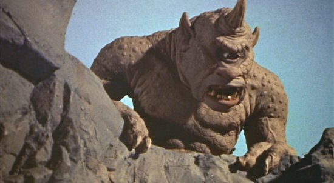
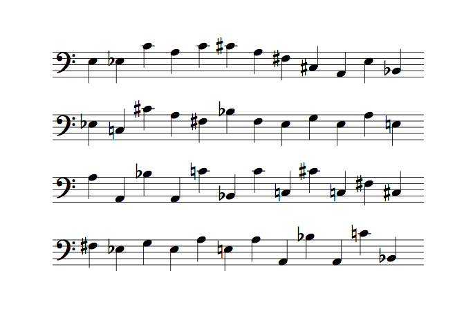
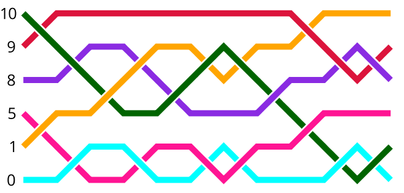
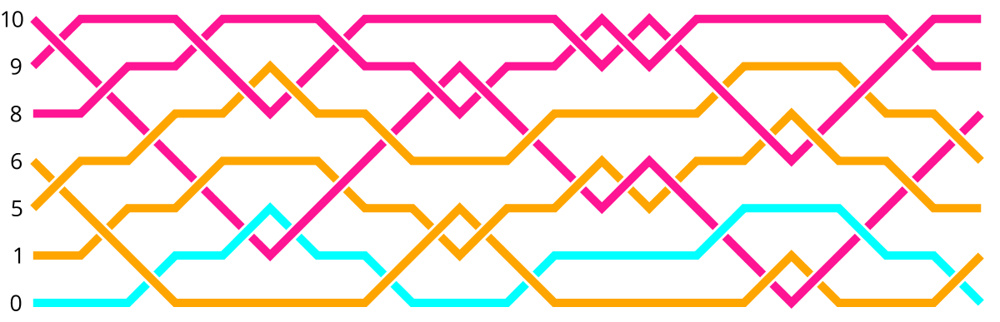
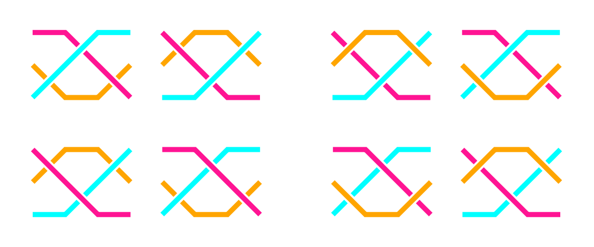
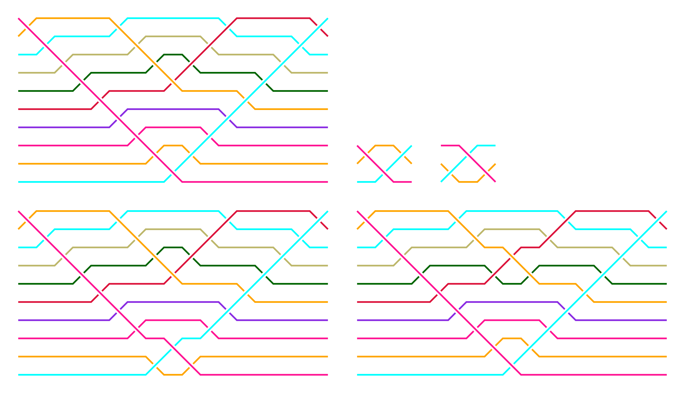

% Composing (Music) in Haskell
% Stuart Popejoy
% March 16, 2016

# Composing Music In Haskell

# Introduction

## Who am I?

- Software developer working in Haskell, formerly in Java
- Musician and composer in NYC

## Roadmap

- Composing with Code
- A Music Primitive: Note = Pitch + Duration
- Motif & Counterpoint: Braids
- Output to Notation: MusicXML

# Composing with Code

##

## WHY????

- Isn't composing music hard enough???
- Getting a computer to "talk music" is really hard

##


<div class="notes">
Iannis Xenakis: 20th century Architect-turned-composer,
pioneered using stochastic methods to produce music
</div>

## Why:

- Formal Approach
- Elaboration
- Experimentation
- Growth

<div class="notes">
- Elaboration: compositional goal, formal approaches
- Experimentation: explore a space, find new sounds
- Growth: mine, as s/w dev and musician together
</div>

## Evolution of Codebase

- Java codebase 2008-2010 ("machinemusic")
- Ported to Clojure 2010-2011
- "Pleonid" realized in Java 2012
- Java -> Haskell 2014
- "Fadno" O/S release 2015, 2016

# Note

## Fundamentals

- Note = Pitch (or pitches) + Duration
- i.e., `(Pitch, Duration)`

## Pitch


## Pitch
- Integrals are easiest to code with
- Enharmonic pitches harder (`E#5`, `G2`)
- Frequency (Hz) not usually supported except for electronic (Supercollider)
- DSLs usually monomorphic, e.g. Chord instead of Note, `Int` pitch etc

## Duration


## Duration

- MIDI, MusicXML use ticks with max divisor
- Rationals the best choice for interop though
- Notation challenges with "tuples" (odd numbers in denominator)

## `Note` datatype

```{.haskell}
data Note p d = Note { _pitch :: p, _dur :: d }
                deriving (Eq,Generic)
$(makeLenses ''Note)
-- Bifunctor, Field1, Field2 instances, |: smart ctor <== DEVELOP HERE, slides for bifunctor, isos etc.
class HasNote s p d | s -> p d where
  note :: Lens' s (Note p d)
  notePitch :: Lens' s p
  notePitch = note.pitch
  noteDur :: Lens' s d
  noteDur = note.dur
instance HasNote (Note p d) p d where note = ($)
```


## `PitchRep`

```{.haskell}
data Spelling = C|Cs|Db|D|Ds|Eb|E|F|Fs|Gb|G|Gs|Ab|A|As|Bb|B
data PitchRep = PitchRep { _prPitch :: Spelling, _prOctave :: Int  }
              deriving (Eq,Ord,Bounded,Generic)
-- plus Integral smart ctor @: -- DEVELOP HERE
instance Num PitchRep where
    fromInteger i = fromChroma i @: ((i `div` 12) - 1)
...
instance Real PitchRep where
    toRational (PitchRep s o) =
       (((fromIntegral o + 1) * 12) + toChroma s) % 1
instance Integral PitchRep where toInteger = truncate . toRational
...
pitchRep :: Integral a => Iso' a PitchRep
pitchRep = iso fromIntegral (fromIntegral . toInteger)
```

## Benefits

- Full power of Haskell number types
- Representation translation as needed for application (MIDI, MusicXML, etc)
- Lenses! Isos!

## Demo

- More than a feeling ...

# Generation: Cyclops

##



##

- Seed melody of 6 pitches
- generated 619 riffs
- used 18 (including seed) in song

## "Mod Diff"

```{.haskell}

seed = map toPitch [E3, A3, E3, D3, G3, D3]

-- DESCRIBE ALGO
differ mod' bias seed s = zipTail calc s ++ [calc (last s) (head s)]
  where
    calc l r = (((r - offset) - (l - offset)) `rem` mod') + offset
    offset = (range `div` 2) + bias + minimum seed
    range = maximum seed - minimum seed

gen n = iterate (differ n 0 seed) seed

genRot n r t =
   pivot $ take t $ iterate (rotate r . differ n 0 seed) seed

```

## Parameterized idea generation

```
--TODO enumerate parameters
> head $ genRot 9 2 48
[52,51,60,57,60,61,57,54,49,45,51,46,51,48,61,57,54,58,54,51,55,51,57,52,
57,45,58,45,60,46,60,48,61,48,54,49,54,51,55,51,57,52,57,45,58,45,60,46]
```

##



## So What Does It Sound Like?

<div><audio src="audio/cyclops-fortalk.mp3" controls="controls"></div>

# Generation: Rhythm, Motif, Counterpoint

blah blah blah


# Braids


# Braids

## Knot Theory

- Braids are a 2D+ projection of a knot
- "Any knot may be represented as the closure of certain braids"
- The class of braids of `n` strands forms a group *B~n~*

## Braid Group B~4~


## Algebra: Braid Generators

{width=400}

## Braids in Haskell

{width=400}

```{.haskell}
renderBraids 100 [colorStrands] "artin.png" $
    [[MultiGen [Step (Gen 1 O) [],Step (Gen 0 U) [Gen 0 U]],
      Artin [Gen 1 O, Gen 0 U, Gen 2 U]]]
```

## `Artin`: Canonical Braid

```{.haskell}
data Polarity = U | O deriving (Eq,Show,Enum,Ord)

data Gen a = Gen { _gPos :: a, _gPol :: Polarity }
    deriving (Eq,Functor,Ord)

newtype Artin a = Artin { _aGens :: [Gen a] }
    deriving (Eq,Show,Monoid,Functor)
instance Foldable Artin where
    foldMap f = foldMap f . map _gPos . _aGens
```

## `MultiGen`: Compressed Braid

```{.haskell}
newtype MultiGen a = MultiGen { _mSteps :: [Step a] }
    deriving (Eq,Monoid)
-- Adjacent generators on a single "step" are invalid!
data Step a =
    Empty |
    Step { _sHead :: Gen a, _sOffsets :: [Gen Natural]
    } deriving (Eq)

stepToGens :: Integral a => Step a -> [Gen a]
stepToGens Empty = []
stepToGens (Step h gs) = reverse $ foldl conv [h] gs
    where conv rs@(Gen p' _:_) (Gen p e) =
                   Gen (fromIntegral p + p' + 2) e:rs
          conv _ _ = error "c'est impossible"
```

## `Braid` typeclass

```{.haskell}
class (Integral b, Monoid (a b)) => Braid (a :: * -> *) b where
    -- | "Length", number of "steps"/columns/artin generators.
    stepCount :: a b -> Int
    -- | "N", braid group index, number of strands/rows/"i"s.
    strandCount :: a b -> b
    -- | Series of "steps" of absolute-indexed generators.
    toGens :: a b -> [[Gen b]]
    -- | Minimum index (i) value
    minIndex :: a b -> b
    -- | Maximum index (i) value. Values of (i+1) obtain.
    maxIndex :: a b -> b
    -- | Invert indices
    invert :: a b -> a b
```

# Braids for Music

## Input: sequence of pitches


## Create single "strand"


## Represent "unders" as longer notes


## Elaboration/Counterpoint: "Terracing"


## Terraced Braid



## Musical properties: Loops
NOTE: 13???


## Musical properties: Loops



##

{width=600}

<div><audio src="audio/braid13.mp3" controls="controls"></div>


# Braid Moves

## Isotopy

- Leaves the topology of the knot unchanged.
- Used to identify different knots/braids as equivalent (word problem).

## Reidemeister Moves

- Simple concept where certain generator patterns are equivalent.
- Move #1 only applies to loops: a single cross is not a knot
- Move #2 straightforward: 

## Reidemeister Move #3

{width=700}

## Applying Move 3

{width=600}

## Finding all moves

```{.haskell}
import Data.Tree
-- structure for braid tree.
-- A permutation is the permuted braid + the [(move,loc)]s that
-- got us there. Thus the root is (original braid, []); children
-- are [(b1,(move,loc))].
makeTree :: (Integral i, Braid a i, Braid b i) =>
       [Move a i] -> b i -> Tree (MultiGen i,[(Move a i,Loc i)])
makeTree mvs org = unfoldTree go (toMultiGen org,[]) where
    go n@(seed,path) =
        (n,concatMap (gen seed path) $ moves mvs seed)
    gen target path (mv,locs) =
        map (\l -> (applyMove mv l target,(mv,l):path)) locs
```

## Demo moves application (finite and infinite)

## Ongoing Work

- Find fixpoints in infinite trees (sharing)
- Expand to include band generator equivalences
- Music: attempt to find "shortest word" for "prettier" counterpoint


# Pleonid

##

- Composed entirely in code
- 60 minutes
- Performed live in 2012

##

<div><video src="audio/pleonid-excerpt-small.mp4" controls="controls"></div>

# Thank You

Stuart Popejoy

[http://slpopejoy.github.io/talks/boston-haskell-music-2016.html](http://slpopejoy.github.io/talks/boston-haskell-music-2016.html)
