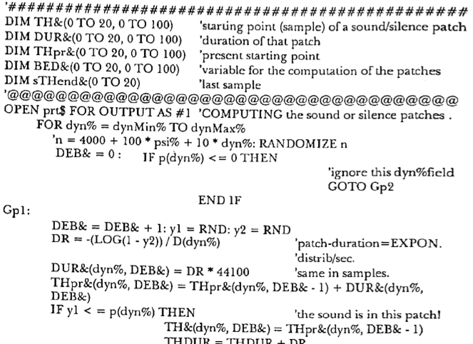
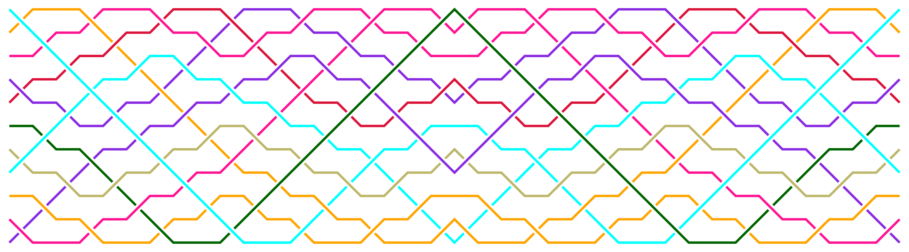
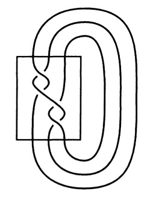
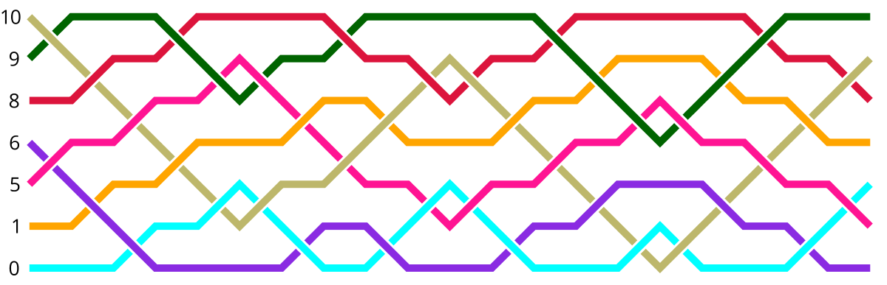
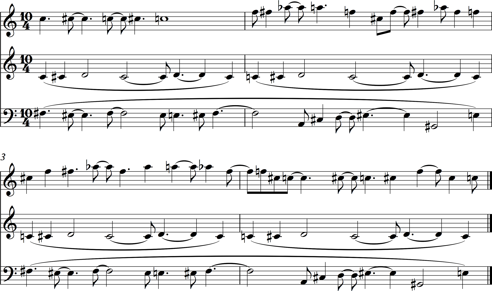

% Composing (Music) in Haskell
% Stuart Popejoy
% October 2016

# Introduction

## Who am I?

- Haskell startup founder
- Musician and composer

## Roadmap

- Composing with Code
- A Music Primitive: Note = Pitch + Duration
- Generative Music: Cyclops
- Motif & Counterpoint: Braids
- Pleonid

## Note on images

- MusicXML -> Sibelius
- Braids -> Diagrams

# Composing with Code

##

## WHY????

- Isn't composing music hard enough???
- Getting a computer to "talk music" is really hard

##


##



<div class="notes">
Iannis Xenakis: 20th century Architect-turned-composer,
pioneered using stochastic methods to produce music
</div>

## Why:

- Formal Approach
- Elaboration
- Experimentation
- Growth

<div class="notes">
- Elaboration: compositional goal, formal approaches
- Experimentation: explore a space, find new sounds
- Growth: mine, as s/w dev and musician together
</div>

## Evolution of Codebase

- Java codebase 2008-2010 ("machinemusic")
- Ported to Clojure 2010-2011
- "Pleonid" realized in Java 2012
- Java -> Haskell 2014
- "Fadno" O/S releases 2015, 2016

# Note

## Fundamentals

- Pitch
- Duration

## Pitch


## Pitch
- Psychoacoustic Phenomena
- Frequency (Hz) used more for synthesis
- Integrals easy to code, hard to read
- Enharmonics (`Ab`,`G`) hard to manipulate, requiring bespoke operations ("transpose", etc)


## `PitchRep`

```{.haskell}

data Spelling = C|Cs|Db|D|Ds|Eb|E|F|Fs|Gb|G|Gs|Ab|A|As|Bb|B

data PitchRep = PitchRep { _prPitch :: Spelling, _prOctave :: Int  }
              deriving (Eq,Ord,Bounded,Generic)

infixl 6 @:
(@:) :: Integral a => Spelling -> a -> PitchRep
s @: o = PitchRep s (fromIntegral o)


```

Examples: `C@:4` ,  `Db@:2`


## `PitchRep` instances

```{.haskell}

instance Num PitchRep where
    fromInteger i = fromChroma i @: ((i `div` 12) - 1)

instance Real PitchRep where
    toRational (PitchRep s o) =
       (((fromIntegral o + 1) * 12) + toChroma s) % 1

instance Integral PitchRep where toInteger = truncate . toRational

pitchRep :: Integral a => Iso' a PitchRep
pitchRep = iso fromIntegral (fromIntegral . toInteger)

```

## Duration


## Duration

- Fractions (powers of 2: `1/2`,  `1/4`,  `3/8`...)
- Tuples: Triplets, Quintuplets
- "Ticks": MIDI/synthesis

## Duration: Good to Go

`Integral` and `Rational` are all we need. Application-specific Iso's are handy though:

```{.haskell}
type IDur = Int

toTicks :: MidiTicks -> Iso' Rational IDur
toTicks t = iso to' from' where
    to' = truncate . (* fromIntegral (t*4))
    from' = (% fromIntegral (t*4)) . fromIntegral
```


## A Polymorphic `Note`

```{.haskell}

data Note p d = Note { _pitch :: p, _dur :: d }
                deriving (Eq,Generic)

infixl 5 |:
(|:) :: p -> d -> Note p d
(|:) = Note

```

`60|:2` &nbsp; ~ &nbsp; `C@:4|:1%4`

## `HasNote`, `toPair`

```{.haskell}
class HasNote s p d | s -> p d where
  note :: Lens' s (Note p d)
  notePitch :: Lens' s p
  notePitch = note.pitch
  noteDur :: Lens' s d
  noteDur = note.dur
instance HasNote (Note p d) p d where note = ($)

toPair :: Iso' (Note p d) (p,d)
toPair = iso (\(Note p d) -> (p,d)) (uncurry Note)

```

## `Bifunctor`, `FieldXX` instances

```{.haskell}
instance Bifunctor Note where
    bimap f g (Note a b) = Note (f a) (g b)

instance Field1 (Note a b) (Note a' b) a a'

instance Field2 (Note a b) (Note a b') b b'
```


## `Note` Niceties

- Full power of Haskell number types
- Ease of translation between types via lenses, isos
- Ease of extension via classes

## Demo

- More than a feeling ...

# Cyclops

##


## Experimentation/Generation

- Seed melody of 6 pitches
- generated 619 riffs
- used 18 (including seed) in song

##

```{.haskell}
differ :: Integral a => Int -> [a] -> [a] -> [a]
differ mod seed s =
  (zipWith calc <*> tail) s ++ [calc (last s) (head s)]
  where calc l r = (((r - offset) - (l - offset))
                    `rem` fromIntegral mod) + offset
        offset = (range `div` 2) + minimum seed
        range = maximum seed - minimum seed

seed = [E@:3, A@:3, E@:3, D@:3, G@:3, D@:3]

gen n = iterate (differ n seed) seed

genRot n r t =
   pivot $ take t $ iterate (rotate r . differ n seed) seed
```

## Parameterized idea generation

```{.haskell}
λ> seed
[E@:3,A@:3,E@:3,D@:3,G@:3,D@:3]
λ> mapM_ print $ take 3 $ gen 9
[E@:3,A@:3,E@:3,D@:3,G@:3,D@:3]
[Bb@:3,C@:3,Eb@:3,Bb@:3,C@:3,G@:3]
[E@:3,Gs@:3,C@:4,E@:3,C@:4,Gs@:3]
λ> head $ genRot 9 2 48
[E@:3,Eb@:3,C@:4,A@:3,C@:4,Cs@:4,A@:3,Fs@:3,Cs@:3,A@:2,Eb@:3,Bb@:2
,Eb@:3,C@:3,Cs@:4,A@:3,Fs@:3,Bb@:3,Fs@:3,Eb@:3,G@:3,Eb@:3,A@:3,E@:3
,A@:3,A@:2,Bb@:3,A@:2,C@:4,Bb@:2,C@:4,C@:3,Cs@:4,C@:3,Fs@:3,Cs@:3
,Fs@:3,Eb@:3,G@:3,Eb@:3,A@:3,E@:3,A@:3,A@:2,Bb@:3,A@:2,C@:4,Bb@:2]
```

##

{width=550}

<div><audio src="audio/cyclops-fortalk.mp3" controls="controls"></div>


# Rhythm

- Pitch concepts well-traveled in theory
- Rhythm not so much
- Need ways to generate pitch AND duration

# Braids



# Braids

## Knot Theory

- Braids are a 2D+ projection of a knot

##



## Braid Group

- The class of braids of `n` strands forms a group *B~n~*

## Braid Group B~4~


## Algebra: Braid Generators

{width=400}

## Braids in Haskell

{width=400}

```{.haskell}
renderBraids 100 [colorStrands] "artin.png" $
    [[MultiGen [Step (Gen 1 O) [],Step (Gen 0 U) [Gen 0 U]],
      Artin [Gen 1 O, Gen 0 U, Gen 2 U]]]
```

## `Artin`: Canonical Braid

```{.haskell}
data Polarity = U | O deriving (Eq,Show,Enum,Ord)

data Gen a = Gen { _gPos :: a, _gPol :: Polarity }
    deriving (Eq,Functor,Ord)

newtype Artin a = Artin { _aGens :: [Gen a] }
    deriving (Eq,Show,Monoid,Functor)

instance Foldable Artin where
    foldMap f = foldMap f . map _gPos . _aGens
```

## `MultiGen`: Compressed Braid

```{.haskell}
newtype MultiGen a = MultiGen { _mSteps :: [Step a] }
    deriving (Eq,Monoid)
-- Adjacent generators on a single "step" are invalid!
data Step a =
    Empty |
    Step { _sHead :: Gen a, _sOffsets :: [Gen Natural]
    } deriving (Eq)

stepToGens :: Integral a => Step a -> [Gen a]
stepToGens Empty = []
stepToGens (Step h gs) = reverse $ foldl conv [h] gs
    where conv rs@(Gen p' _:_) (Gen p e) =
                   Gen (fromIntegral p + p' + 2) e:rs
          conv _ _ = error "c'est impossible"
```

## `Braid` typeclass

```{.haskell}
class (Integral b, Monoid (a b)) => Braid (a :: * -> *) b where
    -- | "Length", number of "steps"/columns/artin generators.
    stepCount :: a b -> Int
    -- | "N", braid group index, number of strands/rows/"i"s.
    strandCount :: a b -> b
    -- | Series of "steps" of absolute-indexed generators.
    toGens :: a b -> [[Gen b]]
    -- | Minimum index (i) value
    minIndex :: a b -> b
    -- | Maximum index (i) value. Values of (i+1) obtain.
    maxIndex :: a b -> b
    -- | Invert indices
    invert :: a b -> a b
```

# Braids for Music

## Input: sequence of pitches


## Create seed strand


## Voila: Rhythm


## Elaboration via "Terracing"


## Terraced Braid



## Musical properties: Loops


##

{width=600}

<div><audio src="audio/braid13.mp3" controls="controls"></div>

## Musical concept

- Create rhythms from pitches
- Create counterpoint from elaboration
- "Regular" structure offering formal unity


# Pleonid

##

- Composed entirely in code
- Single "seed" generated 31 pitch sequences and braids
- Braid counterpoint, Braid Chord "vamps", melody interpretation
- LFSR used for pseudo-random arrangement
- 60 minutes
- Performed live in 2012, release in early 2017

##

<div><video src="audio/pleonid-excerpt-small.mp4" controls="controls"></div>

# Braid Moves

## Isotopy

- Leaves the topology of the knot unchanged.
- Used to identify different knots/braids as equivalent (word problem).

## Reidemeister Moves

- Simple concept where certain generator patterns are equivalent.
- Move #1 only applies to loops: a single cross is not a knot
- Move #2 straightforward: 

## Reidemeister Move #3

{width=700}

## Applying Move 3

{width=600}

## Finding all moves

```{.haskell}
import Data.Tree
-- structure for braid tree.
-- A permutation is the permuted braid + the [(move,loc)]s that
-- got us there. Thus the root is (original braid, []); children
-- are [(b1,(move,loc))].
makeTree :: (Integral i, Braid a i, Braid b i) =>
       [Move a i] -> b i -> Tree (MultiGen i,[(Move a i,Loc i)])
makeTree mvs org = unfoldTree go (toMultiGen org,[]) where
    go n@(seed,path) =
        (n,concatMap (gen seed path) $ moves mvs seed)
    gen target path (mv,locs) =
        map (\l -> (applyMove mv l target,(mv,l):path)) locs
```

## Ongoing Work

- Find fixpoints in infinite trees (sharing)
- Expand to include band generator equivalences
- Music: attempt to find "shortest word" for "prettier" counterpoint


# Thank You

Stuart Popejoy

[https://github.com/slpopejoy/fadno](https://github.com/slpopejoy/fadno)

[https://github.com/slpopejoy/fadno-braids](https://github.com/slpopejoy/fadno-braids)

[https://github.com/slpopejoy/fadno-xml](https://github.com/slpopejoy/fadno-xml)
