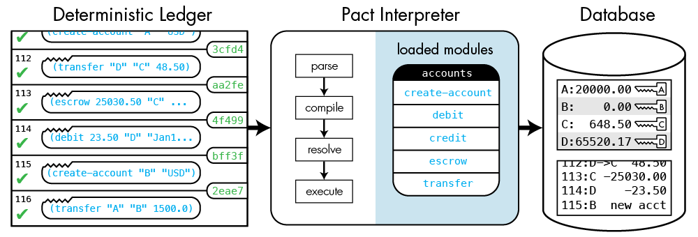

% Pact: A Smart-Contract Language in Haskell
% Stuart Popejoy stuart@kadena.io @SirLensALot
% Boston Haskell April 2017


# Pact: A Smart-Contract Language

## Smart Contracts

"Code that runs in a blockchain"

## Blockchain WTF

- Cryptocurrencies
- Public/Mining/Probabilistic Consensus
- Distributed Ledger aka Database
- Private/Non-Probabilistic Consensus
- Blockchain != BFT


## Blockchain == Trustworthy ...

- Distributed & Replicated
- Fault Tolerant
- Disaster-resistant
- Highly Available
- Highly Auditable

## Smart Contracts WTF

- "Code that runs in a blockchain"
- "World Computer" (Ethereum)
- Distributed stored procedures ... ?
- Business rules ... ?
- Transaction/Asset modeling ... ?


## Smart Contracts a la Pact

<i>Hot-deployed, simple, interpreted code <br> implementing deterministic logic <br> for capturing ordered events in <br>
a distributed (maybe disjoint) database, <br> enforcing invariants and authorization rules.</i>

# Design Approach

## &nbsp;

- Learn from Bitcoin
- Learn from Ethereum
- Learn from Experience
- Write Some Haskell

## Learn from Bitcoin


## Learn from Bitcoin

- Highly constrained
- Turing-incomplete
- Authorization-focused
- Stylized runtime environment

## Learn from Ethereum (Good)

- [github.com/kadena-io/masala](https://github.com/kadena-io/masala)
- Deterministic
- Transactional

## Learn from Ethereum (Bad)

- Compiled => Too Low Level
- Solidity => O.R. Sucks
- Interop/Services Hard
- Unsafe

## Learn from Experience

- RDBMS languages
- DSLs in Trading Systems
- Simplicity => Safer
- Simplicity => Faster
- Simplicity => Wider Audience

## Write Me (Us) Some Haskell

- First impl done in a month
- O/S'd September 2016
- GHCJS/Web editor
- Typechecker/SMT-LIB2 compiler Jan 2016

# Introduction to Pact

## Pact Basics

- Interpreted LISP
- DB-focused, backend-agnostic
- Authorization (not authentication)
- Turing-incomplete
- Single-assignment
- Type inference

## System architecture



## &nbsp;

```{.commonlisp}
(define-keyset 'keyset-admin (read-keyset "ks-admin"))
(define-keyset 'keyset-operator (read-keyset "ks-op"))

(module employees 'keyset-admin
  "Employee management smart contract."
  (defschema employee name:string
                      age:integer
                      salary:decimal)

  (deftable employees:{employee})

  (defun add-employee (id name age salary)
    (enforce-keyset 'keyset-operator)
    (insert employees id
      { "name": name, "age": age, "salary": salary })))
(create-table employees)
```

# Database Metaphor

## Concepts

- OLTP good (but not enough)
- OLAP bad (but need latest value)
- Versioning good
- One lang to rule them all

## "Key-Row" Structure

- Key-Value with field access, schema
- Mutable metaphor ("latest value")
- Direct, JSON-like representation in code

## Automatic versioning


## RDBMS back end

- Kadena defaults to SQLite (fast)
- Data is "trapped in the blockchain"
- Plug in Oracle, DB2, Postgres
- Build your own

# Developing with Pact

- [Web Editor](http://kadena.io/try-pact)
- Full database-backed dev environment (`pact -serve`)
- Atom integration with linter: continuous testing


# Formal Verification with Z3

## Pact makes proving ~~easy~~ tractable

- Already SSA
- No recursion
- Already "inlined"
- Typechecker outputs typed AST

## &nbsp;


## But what do we prove?

- DB is a big, mutable global variable
- Let's track a column
- Does it stay within range?
- Does it "conserve mass"?

## "DocTest" proof specification

```{.commonlisp}
(defun pay (from to amount)

  "Transfer money between accounts \
  \{-# PROVE 'accounts.balance' [ConservesMass, Column >= 0] #-}"

  (with-read accounts from { "balance":= from-bal }
    (with-read accounts to { "balance":= to-bal }
      (enforce (>= from-bal amount) "Insufficient Funds")
      (update accounts from
        { "balance": (- from-bal amount) })
      (update accounts to
        { "balance": (+ to-bal amount) }))))
```

## Demo

Pact -> SMT-LIB2 -> Z3

## What's Next For Formal Verification

- Full Datatype Support
- More DSL Cases
- Richer operators

# Haskell Implementation Notes

## Runtime

- `parsers` (`attoparsec` w/ tokens!): `Text` -> `Exp`
- Compilation: `Exp` -> `Term Name`, with `bound`
- Module load: `Term Name` -> `Term Ref`
- `LANGUAGE GenericNewTypeDeriving` for days

## Back-end

- "Funrecs" instead of typeclasses
- Fun with production DBs
- `MVar`s instead of `State`
- Exceptions (`IO`) instead of `MonadError`

## Typechecker

- Further lowering: `Term Ref` (inlined) -> `AST UserType`
- Natives and overloads
- Homebrew algo -> semi-HM (binary substitution)

## Z3 compiler

- Consumes typechecker AST (must fully typecheck)
- `SmtLib` for issuing SMT-LIB2

## Haskell Advantage

- Faster, rock-solid refactors
- PL tooling (bound, parsers, SmtLib)
- Exposure to formal verification
- GHCJS
- Hubris & Intimidation

# Thank You

Stuart Popejoy stuart@kadena.io @SirLensALot

Pact Github [https://github.com/kadena-io/pact](https://github.com/kadena-io/pact)

Pact site [http://kadena.io/pact](http://kadena.io/pact)

Web editor [http://kadena.io/try-pact](http://kadena.io/try-pact)

[http://slpopejoy.github.io/talks/pact-haskell-boston-2017.html](http://slpopejoy.github.io/talks/pact-haskell-boston-2017.html)
