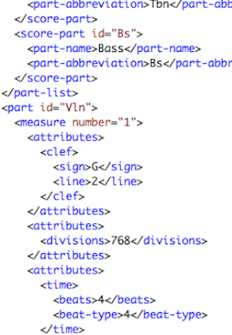
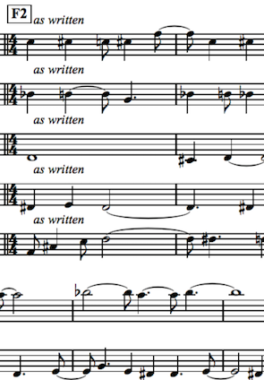
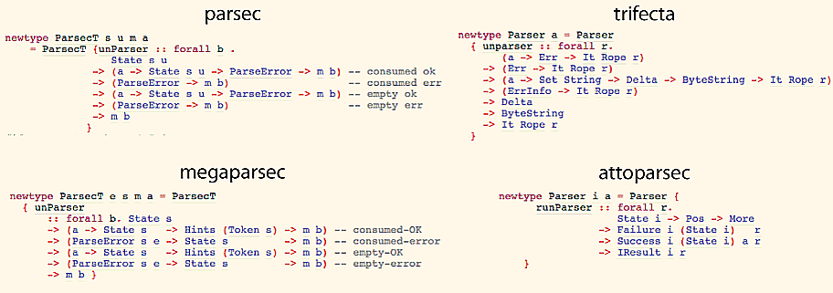

% Parsing parsed parseables, from music to Megaparsec
% Stuart Popejoy stuart@kadena.io @SirLensALot
% NY Haskell, Oct 2018

# Parsing in Haskell

* 16:32 **haskn00b**: any pointers on good regex libs in haskell? thanks!
* 16:33 **shw**: yeah ... parsec
* 16:33 **haskn00b**: cool!
* 16:53 **haskn00b**: shw: i don't see the regex part. How am I supposed to handle text?
* 16:54 **shw**: Regex can deceive you. Stretch out with your feelings!
* 16:54 **haskn00b**: _writes entire app in bash_

# Parser Combinators

## A "greatest hit" of Haskell
```haskell
expr :: CharParsing m => m Expr
expr = (ENumber <$> scientific) <|>
       (EString <$> stringLiteral) <|>
       (EAtom <$> identifier) <|>
       (EList <$> parens (sepBy expr spaces))
```

Absurdly expressive, BNF-like moxie

## Main elements
- Alternative: `<|>`, `empty`, `some`, `many`
- Functor: `<$>`
- Applicative: `pure`, `<*>`, `<*`, `*>`
- MonadPlus: `mzero`, `mplus`
- Other: `sepBy`, `optional`, `satisfy`

## Dogfooding

```haskell
class (Alternative m,MonadPlus m) => CharParser m where
  satisfy :: (Char -> Bool) -> m Char

char :: CharParser m => Char -> m Char
char c = satisfy (c ==)

parens :: (CharParser m) => m a -> m a
parens p = char '(' *> p <* char ')'
```

## Parse you a LISP
```haskell
data Expr =
     ENumber Scientific
   | EString Text
   | EAtom Text
   | EList [Expr]

expr :: CharParsing m => m Expr
expr = (ENumber <$> scientific) <|>
       (EString <$> stringLiteral) <|>
       (EAtom <$> identifier) <|>
       (EList <$> parens (sepBy expr spaces))
```
```lisp
(defun div (a b)
  "Divide A by B and return rounded amount."
  (if (eq b 0) (error "Div by 0!")
    (round (/ a b))))
```

## Parse you a LISP
```lisp
(defun div (a b)
  "Divide A by B and return rounded amount."
  (if (eq b 0) (error "Div by 0!")
    (round (/ a b))))
```
```haskell
EList [EAtom "defun", EAtom "div", EList [EAtom "a", EAtom "b"]
  , EString "Divide A by B and return rounded amount."
  , EList [EAtom "if", EList [EAtom "eq", EAtom "b", ENumber 0]
          , EList [EAtom "error", EString "Div by 0!"]
          , EList [EAtom "round"
                  , EList [EAtom "/", EAtom "a", EAtom "b"]]]]
```

# My War: MusicXML

## &nbsp;




## The Problem

- I've generated a bunch of music data
- I need to perform it with humans
- I need to create decent sheet music
- Lilypond jumps the shark, MusicABC too trivial

## The "Solution"

- MusicXML, the "pro" way to go
- Lots of printing support
- In Java, use JAXB
- In Haskell ...

## Use a hand-rolled MusicXML emitter on hackage

- Only implements whatever the author got around to
- Only supports author's idiosyncratic music lib
- MusicXML v2.0 only

## Wait! I have a terrible idea

- MusicXML fully specified in XSD
- Ooh look a library to spit out DSLs from XSD!
- Ooh look it's been abandoned since 2011

_(rolls up sleeves)_

## Let's generate a MusicXML library from XSD

- Generate a DSL that will always correctly spit out XML
- Load XSD as an AST
- Need to "recognize" streams of XSD XML

## Huh, that sounds a lot like a ... parser

```haskell
-- | Recognize attribute group
attributeGroup :: XParser m => m AttributeGroup
attributeGroup = do
  atEl (xsName "attributeGroup")
  AttributeGroup . qn <$> attr (name "name")
        <*> attrs <*> documentation
     <|> (AttributeGroupRef . Unresolved . qn)
        <$> attr (name "ref")

-- | Recognize attributes and attributeGroups
--   (which often come together).
attrs :: XParser m => m Attributes
attrs = Attributes <$>
    findChildren (xsName "attribute") attribute <*>
    findChildren (xsName "attributeGroup") attributeGroup
```

# XML element parser combinator

## Take 1: StateT List + Except

```haskell
-- | XParser constraint kind. Stack state + alternative + errors.
type XParser m =
  (Alternative m, MonadState [X.Element] m, MonadError String m)

-- | run XParser on an element.
parseX :: (Monad m) => StateT [X.Element] (ExceptT String m) b
       -> X.Element -> m (Either String b)
parseX sel e = runExceptT (evalStateT sel [e])
```
Just like that, `<|>`, `optional`, failure/try/catch ...

## Build you a MusicXML DSL emitter

- Was able to parse the entire MusicXML XSD (~4500 lines)
- Generated a monster Haskell module (~8000 lines)
- Shipped the piece

## But not a MusicXML reader

- Wanted to also _read_ MusicXML to populate the DSL
- `XParser` unable to preserve element order (not needed in the MusicXML XSD)
- Bad `try` semantics (no way to fail to parent)

## Take 2: StateT Cursor + Except

```haskell
import qualified Text.XML.Light.Cursor as C

newtype XParse a = XParse
    { unXParse :: StateT C.Cursor (Except XErrors) a }
  deriving (Functor,Applicative,Monad,MonadState C.Cursor,
            MonadError XErrors,Alternative)

runXParse :: X.Element -> XParse a -> Either XErrors a
runXParse e act =
  runExcept (evalStateT (unXParse act) (C.fromElement e))
```

## A two-headed beast

- New parser works for codegen MusicXML reading (module now ~11,500 lines)
- Wasn't able to quickly replace the old XSD parser
- Future work: bootstrap from the XSD XSD

# The Pact Parser and Compiler

## What is Pact?

- LISP/sexp syntax smart contract language
- Part of the Kadena blockchain platform
- Key/value DB language, public-key multisig support
- Turing incomplete: strict, no recursion, no lambdas
- Type inference, partial application, map/filter/fold/compose
- Formal verification via embedded DSL, direct compilation to SMT-LIB2

## Pact Parser/Compiler, v1

- Parser: coded using `parsers`, from `Text` to `Exp`
- Parse with `trifecta` in SDK, `attoparsec` on blockchain
- "Compiler" written in spaghetti Haskell: from `Exp` to `Term Name`

## Compiler v1: Pattern matching for days

```haskell
defconst :: [Exp] -> Info -> Compile (Term Name)
defconst es i = case es of
  [EAtom dn Nothing ct _,t] -> mkConst dn ct t Nothing
  [EAtom dn Nothing ct _,t,ELitString docs] ->
    mkConst dn ct t (justDocs docs)
  [EAtom dn Nothing ct _,t,EList' (ELitString docs:ps)] ->
    mkMeta docs ps >>= \m -> mkConst dn ct t m
  _ -> syntaxError i "Invalid defconst"
  where
    mkConst dn ty v docs = do
      v' <- run v
      cm <- currentModule i
      a <- Arg <$> pure dn <*> maybeTyVar i ty <*> pure i
      return $ TConst a (fst cm) (CVRaw v') docs i
```

## Pattern-based recognition

- Hard to reuse matching logic
- Pattern syms not enough
- Hard to factor
- Fast and "just works"

## Embedding a FV DSL in Pact

```lisp
(module accounts 'accounts-admin-keyset
  @model [(defproperty conserves-mass
            (= (column-delta 'accounts 'balance) 0.0))]

  (defschema account
    @model (invariant (>= balance 0.0))
    balance:decimal
    auth:keyset)
  (deftable accounts:{account})

  (defun transfer (src:string dest:string amount:decimal)
    @model (property conserves-mass)
    (debit src amount)
    (credit dest amount)) ...
```

## Embedding a FV DSL in Pact

- Pact parser "too smart"
- E.g., all literal types recognized in parser
- Need "sexps only"

## The Pact Parser, v2
Emit a drastically simplified `Exp` of lists,
atoms, literals and delimters
```haskell
data Exp i =
  ELiteral (LiteralExp i) |
  EAtom (AtomExp i) |
  EList (ListExp i) |
  ESeparator (SeparatorExp i)
  deriving (Eq,Ord,Generic,Functor,Foldable,Traversable)
```

## But what about the compiler

- Major refactor
- Compiler has to work with a far less rich `Exp`
- Wouldn't it be nice if we could "parse" over `Exp`?

## Parsing over `Exp` ASTs

Start with the "better XML parser" shape, with homebrew cursor

```haskell
data Cursor = Cursor
  { _cContext :: Maybe (Cursor,Exp Info)
  , _cStream :: [Exp Info] }

type ExpParser a = StateT Cursor (Except PactError) a
```

## Improvement to Compile code

```haskell
defconst :: Compile (Term Name)
defconst = do
  modName <- currentModule'
  a <- arg
  v <- term
  m <- meta
  TConst a modName (CVRaw v) m <$> contextInfo
```

## Problems with StateT + Except

- `Except` is too blunt a tool
  - Unclear when an alternative "commits"
- `State` overly general
  - Complex handling for tree-backed backtracking
- Excessive need for `try`
- Probably slow
- Why not ... look at what "real" parsers do

# How Parsers Work

## Continuation Passing For Days


## The Four Continuations of the Parsocalypse

- "Commit OK": recognize, proceed, commit to this path
- "Commit error": fatal error, unless in `try`
- "Epsilon/Empty OK": recognize, proceed, don't commit
- "Epsilon/Empty error": recoverable error

## What's the problem?

```haskell
-- Parsec Monad bind
parserBind :: ParsecT s u m a -> (a -> ParsecT s u m b)
           -> ParsecT s u m b
parserBind m k = ParsecT $ \s cok cerr eok eerr ->
  let mcok x s err =
        let peok x s err' = cok x s (mergeError err err')
            peerr err'    = cerr (mergeError err err')
        in  unParser (k x) s cok cerr peok peerr
      meok x s err =
        let peok x s err' = eok x s (mergeError err err')
            peerr err'    = eerr (mergeError err err')
        in  unParser (k x) s cok cerr peok peerr
  in unParser m s mcok cerr meok eerr
```

## Path-following state modeled as CP


```haskell
parserBind m k = ParsecT $ \s cok         cerr eok eerr ->
                 --           ^ commit-ok ^ commit-error
  let mcok x s err =
        let peok x s err' = cok x s (mergeError err err')
            --              ^ routes to commit-ok!
            peerr err'    = cerr (mergeError err err')
            --              ^ routes to commit-error!
        in unParser (k x) s cok cerr peok     peerr
           --                        ^ eps-ok ^ eps-err
      ...
  in unParser m s mcok cerr meok eerr
     --           ^ commit path
```
Commit path "re-routes" epsilon paths

## Path-following state modeled as CP

```haskell
parserBind m k = ParsecT $ \s cok cerr eok      eerr ->
                 --                    ^ eps-ok ^ eps-error
  let ...
      meok x s err =
        let peok x s err' = eok x s (mergeError err err')
            peerr err'    = eerr (mergeError err err')
        in  unParser (k x) s cok cerr peok     peerr
            --                        ^ eps-ok ^ eps-err
  in unParser m s mcok cerr meok eerr
     --                     ^ epsilon path
```
Epsilon path doesn't re-route, just merges errors

## Haskell Parser Semantics

- Commit on "leftmost" item in a given alternative
- Subsequent "epsilon" successes or failures stay on commit path
- Longer success paths must happen in `try`
- [Atto not analyzed for this talk]

## Now, how to write a non-`Char` stream parser?

- Semantics are hard
- Performance is harder
- If only a parser library supported arbitrary streams ...

# Megaparsec 6.x to the rescue

## `Stream` typeclass for arbitrary input streams

```haskell
class (Stream s, MonadPlus m) => MonadParsec e s m where ...
```

```haskell
class (Ord (Token s), Ord (Tokens s)) => Stream s where
  type Token s :: *
  type Tokens s :: *
  ...
```

## `getInput`, `setInput` for "include files"
- Allows arbitrary re-setting of `Stream` data
- Intended to support includes
- Includes _a.k.a._ sourcefile trees
- `Exp` ASTs, XML bodies: trees

## Need "current thing"

- Char parsers don't need to see what we just parsed
- Need some extra state to show the current `Exp`
- Good thing `MonadParsec` has all the instances!

## And we're done!

```haskell
instance Stream Cursor where
  type Token Cursor = Exp Info
  type Tokens Cursor = [Exp Info]
  ...

data ParseState a = ParseState
  { _psCurrent :: (Exp Info) }

type ExpParse s a = StateT (ParseState s) (Parsec Void Cursor) a
```

## We're not done ...

When parsing sexps, we'd like `specialForm` to recognize the first atom,
otherwise assume we're doing normal LISP function application.

```haskell
sexp :: Compile (Term Name)
sexp = withList' Parens (specialForm <|> app)

```
```lisp
(let ((a 1)) a) ;; special form
(use accounts)  ;; special form
(+ 1 2)         ;; apply `+`
```

## Sexp: special form or app

`specialForm` switches on the text of a "bare atom"
while `app` accepts any bare/qualified/typed atom.

```haskell
specialForm :: Compile (Term Name)
specialForm = bareAtom >>= \AtomExp{..} -> case _atomAtom of
    "use" -> useForm
    "let" -> letForm
    ...
    _ -> expected "special form"

app :: Compile (Term Name)
app = do
  v <- varAtom
  body <- many (term <|> bindingForm)
  TApp v body <$> contextInfo
```

## Delegating/factored combinators

`bareAtom` delegates to the `atom` combinator.

```haskell
atom :: ExpParse s (AtomExp Info)
atom = fst <$> exp "atom" _EAtom

bareAtom :: ExpParse s (AtomExp Info)
bareAtom = atom >>= \a@AtomExp{..} -> case _atomQualifiers of
  (_:_) -> expected "unqualified atom"
  [] -> return a
```

## `exp`, the base case `Exp` test

`atom` uses `exp` to apply a `Prism` to the `Exp` that is at the cursor,
via `token`.

```haskell
exp :: String -> Prism' (Exp Info) a -> ExpParse s (a,Exp Info)
exp ty prism = do
  let test i = case firstOf prism i of
        Just a -> Right (a,i)
        Nothing -> err i ("Expected: " ++ ty)
      err i s = ...
  r <- lift $ token test
  return r
```


## `token`, the hook into Megaparsec

`exp` uses megaparsec's `token`, which hooks into
megaparsec's semantics.

```haskell
class (Stream s, MonadPlus m) => MonadParsec e s m where ...
  token :: (Token s -> Maybe a) -> Set (ErrorItem (Token s)) -> m a
```
The `(Token s -> Maybe a)` argument is the predicate to indicate success.

## Quiz: where does commit happen?

- `sexp`
- `specialForm`
- `app`
- `bareAtom`
- `atom`

## `atom`: way too soon

- Consider a bad let: `(let (foo bar))`
- `letForm` would discover error
- But error context would be at top of `specialForm`
- i.e., terrible UX
- `try` around `specialForm` could fail to `app`

## The problem with non-Char parsers

- `token` commits on the first test
  - `Char`-based parsers _never introspect on a string_
  - Thus a single "leftmost term" test suffices
- Whereas an `Exp` parser needs to introspect:
  - atom? + unqualified? + atom text is correct?
- `try` can't represent certain paths
- `try` is slow as a base case

## So now what?

- `token` is the only way in and uses predicates
- Model low-level combinators as predicates
- Requires a different shape for "pre-commit" combinators
  - would probably need "committing" versions too
- Yuck!

# Hacking a non-Char Megaparsec

## A better solution: controlled commit

- Need an "epsilon `token`" to linger on the epsilon path
- Need an _explicit combinator_ to switch to commit path
- Need clear semantics on when commit occurs

## Explicit commit: the easy part

Simply create a "commit OK" combinator
```haskell
-- | Call commit continuation with current state.
pCommit :: forall e s m. ParsecT e s m ()
pCommit = ParsecT $ \s cok _ _ _ -> cok () s mempty

-- | Commit any previous recognitions.
commit :: ExpParse s ()
commit = lift pCommit
```

## Epsilon Token: hacky copypasta
```haskell
pTokenEpsilon ::
  Stream s => (Token s -> S.Set (ErrorItem (Token s)))
  -> Maybe (Token s) -> ParsecT e s m a
pTokenEpsilon test =
  ParsecT $ \s@(State input (pos:|z) tp w) _ _ eok eerr ->
    case take1_ input of
      Nothing -> eerr ...
      Just (c,cs) -> case test c of
        Left (us, ps) -> eerr ...
        Right x ->
          let !npos = advance1 (Proxy :: Proxy s) w pos c
              newstate = State cs (npos:|z) (tp + 1) w
          in eok x newstate mempty
          -- ^ only change from original 'token' is `cok` -> `eok`
```

## Success!

- `exp` uses `pTokenEpsilon`, non-committing
- "low-level" combinators (`atom` etc) don't commit
- Examples of committing combinators:
  - list entering (`withList'` etc)
  - `symbol` (single-path bare atom text)
  - `sep` (`exp` + separator match)
- otherwise user code explicitly `commit`s

## Explicit commit in action

```haskell
specialForm :: Compile (Term Name)
specialForm = bareAtom >>= \AtomExp{..} -> case _atomAtom of
    "use" -> commit >> useForm
    "let" -> commit >> letForm
    "let*" -> commit >> letsForm
    "defconst" -> commit >> defconst
    "step" -> commit >> step
    "step-with-rollback" -> commit >> stepWithRollback
    "bless" -> commit >> bless
    "deftable" -> commit >> deftable
    "defschema" -> commit >> defschema
    "defun" -> commit >> defun
    "defpact" -> commit >> defpact
    "module" -> commit >> moduleForm
    _ -> expected "special form"
```

# Postscript

## WTF is "Simplifier ticks exhausted"?

Add a single `INLINE` to Pact.Compile and ...
```
[72 of 87] Compiling Pact.Compile     ( src/Pact/Compile.hs, .stack-work/dist/x86_64-osx/Cabal-1.24.2.0/build/Pact/Compile.o )
ghc: panic! (the 'impossible' happened)
  (GHC version 8.0.2 for x86_64-apple-darwin):
	Simplifier ticks exhausted
  When trying RuleFired ++
  To increase the limit, use -fsimpl-tick-factor=N (default 100)
  If you need to do this, let GHC HQ know, and what factor you needed
  To see detailed counts use -ddump-simpl-stats
  Total ticks: 200681

Please report this as a GHC bug:  http://www.haskell.org/ghc/reportabug
```

# Thank You!

Stuart Popejoy stuart@kadena.io @SirLensALot

Pact <br><https://github.com/kadena-io/pact>

Fadno-XML <br><https://hackage.haskell.org/package/fadno-xml>

Megaparsec <br><http://hackage.haskell.org/package/megaparsec>

This talk<br>
<http://slpopejoy.github.io/talks/parsing-ny-haskell-2018.html>
