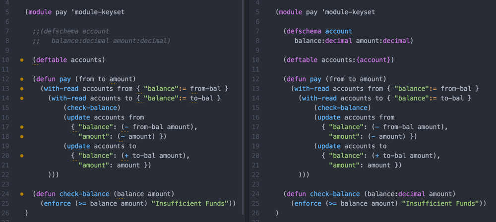

% Pact: A LISP for Smart Contracts
% Stuart Popejoy, Kadena
% January 2017

# Introduction

## Kadena

- Founded in 2016 from JPM blockchain group
- Tangaroa -> Juno
- ScalableBFT, the "first real private blockchain"
- Pact

## Me

- Musician - programming in C in 1988
- C, Java, JS, Clojure, SuperCollider, Haskell
- Apple 1992->DBs->Webs->Finance 2001-2016
- Algo Genetics
- JPM NPD 2014-2016
- Kadena

## Pact
- Interpreted LISP
- Turing-incomplete
- Single-assignment
- DB-focused, backend-agnostic
- Type inference

## Roadmap

- Pact Architecture
- Smart Contracts
- Database Metaphor
- Public-key Auth
- Safer Contracts
- Confidentiality & "Pacts"
- Types & Z3/Prover preview

# Pact Architecture

##


## System Requirements: DL Front end

- Total ordering
- Single-threaded
- Signatures verified, Multi-sig support
- Provide ordered transaction ID

## System Requirements: DB Back end

- Fast
- Key-Value/JSON support

## Modules, Tables, Keysets

- A `module` defines functions, types and tables
- Keysets guard admin and business operations

```{.commonlisp}
(module employees 'employees-admin ;; admin keyset

  (defschema employee
    name:string age:integer salary:decimal)

  (deftable 'employees:{employee})

  (defun add-employee (id name age salary)
    (enforce-keyset 'empl-operator) ;; biz keyset
    (insert employees id
      { "name": name, "age": age, "salary": salary })))
```

# Smart Contracts

## What Aren't They?

- Autonomous orgs/AI
- "Experts Only"
- Hard forks/binary installs

## What Are They?

- User code
- Mobile code/code-as-data
- Event representation
- Authentication/Authorization
- As simple/safe as possible

## How?

- Database metaphor
- Public-key auth support
- "Just enough" computation
- Human-readable
- Testability/Verification

# Database Metaphor

## Concepts

- OLTP good
- OLAP not so much
- Versioned history needed
- One lang to rule them all
- No Nulls!

## "Key-Row" Structure

- Latest value always available
- JSON-like representation in code
- Special binding form: `with-read`

```{.commonlisp}
(with-read accounts acct-key { "balance" := bal, "ccy" := ccy }
  (format "balance for {}: {} {}" acct-key bal ccy))
```

## Automatic versioning


## No Nulls

- Violates relational calculus :)
- Enforces totality
- Avoids control flow
- Missing rows ok

```{.commonlisp}
(with-read-default inventory inv-item { "count" := count }
  { "count" : 0 }
  (format "found {} widgets" count))
```

## RDBMS back end

- Kadena defaults to SQLite (fast)
- But then you have to hit the API ...
- Plug in Oracle, DB2, Postgres!

# Public-key Auth

## Concepts

- Inspired by Bitcoin scripts
- Code doesn't verify but enforces matches
- `keyset` concept combines a set of keys and a rule
- Table access within module is unguarded

## &nbsp;


```{.json}
/* JSON part of message. keys-2 requires at least 2 keys to match */
{ "keyset": { "keys": ["CEO","CTO","Mom"], "pred": "keys-2" } }
```
```{.commonlisp}
(define-keyset 'admin-keyset (read-keyset "keyset"))
(module bonus 'admin-keyset
  (deftable bonus)
  (defun supersize-bonus (me)
    (enforce-keyset 'admin-keyset) ;; must be admin
    (update bonus me { "amount": 1000000.0 }))
  ;;anybody can view bonuses!
  (defun read-bonus (id) (read bonus id)))
```
## Row-level keysets

Keysets can be stored in the database and used for "row-level" auth.

```{.commonlisp}
  (defun update-ssn (id ssn)
    (with-read persons id { "keyset" := ks }
      (enforce-keyset ks)
      (update persons id { "ssn": ssn })))
```

# Safer Contracts

## "Just enough" Computation

- No recursion (allows inlining)
- Looping only over (non-infinite) lists
- Single assignment

## Human-readable

- Interpreted vs compiled
- LISP "Just the AST please"
- Modules not addresses
- Module == Smart Contract API

## "Just enough" typing



# Confidentiality

## &nbsp;


## Disjoint Databases


## "Pacts"

```{.commonlisp}
(defpact payment (payer payer-entity
                  payee payee-entity amount date)

  ; step 1: debit from payer
  (step-with-rollback payer-entity
    (debit payer amount date { "payee": payee })
    ; rollback if step 2 fails
    (credit payer amount date))

  ; step 2: credit to payee
  (step payee-entity
    (credit payee amount date { "payer": payer }))
)
```

## &nbsp;


# Pact 2.0 - Types

# Z3/Prover preview

## &nbsp;


# Thank You

Stuart Popejoy

[http://slpopejoy.github.io/talks/ny-haskell-music-2016.html](http://slpopejoy.github.io/talks/ny-haskell-music-2016.html)

[https://github.com/slpopejoy/fadno](https://github.com/slpopejoy/fadno)

[https://github.com/slpopejoy/fadno-braids](https://github.com/slpopejoy/fadno-braids)

[https://github.com/slpopejoy/fadno-xml](https://github.com/slpopejoy/fadno-xml)
